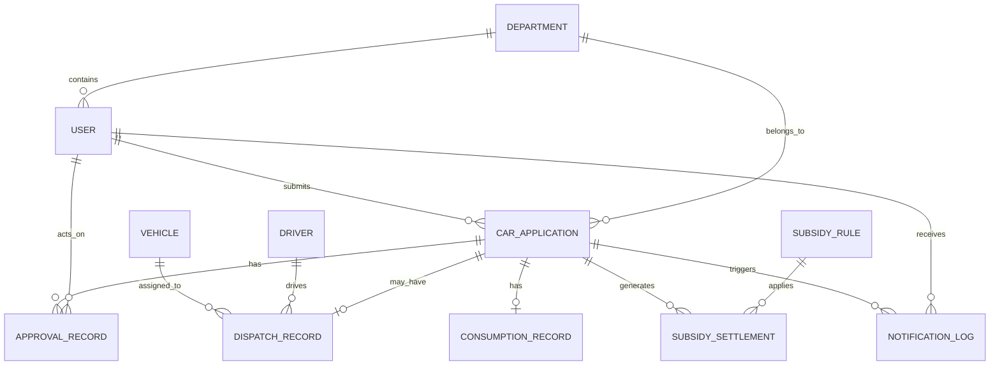

# 公务用车管理系统：数据模型设计文档 V1

> ⚠️ 本文档为 V1 设计阶段产物，合并自《数据实体关系与核心字段V1》和《数据库表结构初稿V1》。基于 Java/MySQL 栈设计，实际实现为 Express + TypeScript + JSON 文件存储。具体实现以代码和 CLAUDE.md 为准。

## 1. 设计约定

### 命名约定
- 表名：小写下划线
- 主键：`id`
- 外键：`xxx_id`
- 时间字段：`*_at`（datetime）/ `*_date`（date）
- 状态字段：`status`

### 通用字段
`id`, `created_at`, `created_by`, `updated_at`, `updated_by`, `is_deleted`

### 数据类型
- 主键：`bigint`
- 金额：`decimal(12,2)`
- 里程：`decimal(10,2)`
- 时长：`decimal(10,2)`
- 状态：`varchar(32)`
- 扩展：`json`

### 设计原则
- 业务主实体与审批过程实体分离
- 资源实体与状态记录分离
- 核算结果与核算规则快照分离
- 私车公用采用"记录总里程 + 导航核验里程 + 核算里程"建模
- 关键状态变更保留日志和快照

## 2. 实体关系

## 3. 核心表清单

| 序号 | 表名 | 说明 |
|------|------|------|
| 1 | `sys_user` | 用户表 |
| 2 | `sys_department` | 部门表 |
| 3 | `car_vehicle` | 车辆表 |
| 4 | `car_driver` | 司机表 |
| 5 | `car_application` | 用车申请表 |
| 6 | `car_application_operation_log` | 操作日志表 |
| 7 | `car_approval_record` | 审批记录表 |
| 8 | `car_dispatch_record` | 派车记录表 |
| 9 | `car_consumption_record` | 消耗记录表 |
| 10 | `car_subsidy_rule` | 补助规则表 |
| 11 | `car_subsidy_settlement` | 补助核算表 |
| 12 | `msg_notification_log` | 通知记录表 |
| 13 | `sys_config` | 系统配置表 |
| 14 | `sys_sync_log` | 同步日志表 |
| 15 | `sys_integration_log` | 集成调用日志表 |

## 4. 详细表结构

### 4.1 sys_user 用户表

| 字段 | 类型 | 说明 |
|------|------|------|
| id | bigint | 主键 |
| feishu_user_id | varchar(64) | 飞书用户 ID，唯一索引 |
| feishu_open_id | varchar(64) | 飞书 open_id |
| user_name | varchar(64) | 姓名 |
| mobile | varchar(32) | 手机号 |
| email | varchar(128) | 邮箱 |
| department_id | bigint | 所属部门 |
| manager_user_id | bigint | 上级用户 |
| user_status | varchar(32) | 在职/停用 |
| role_tags | json | 角色标签集合 |

索引：`uk_feishu_user_id`, `idx_department_id`

### 4.2 sys_department 部门表

| 字段 | 类型 | 说明 |
|------|------|------|
| id | bigint | 主键 |
| feishu_department_id | varchar(64) | 飞书部门 ID，唯一索引 |
| department_name | varchar(128) | 部门名称 |
| parent_id | bigint | 上级部门 |
| leader_user_id | bigint | 部门负责人 |
| department_status | varchar(32) | 启用/停用 |

索引：`uk_feishu_department_id`, `idx_parent_id`

### 4.3 car_vehicle 车辆表

| 字段 | 类型 | 说明 |
|------|------|------|
| id | bigint | 主键 |
| vehicle_no | varchar(64) | 车辆编号 |
| plate_no | varchar(32) | 车牌号，唯一索引 |
| vehicle_model | varchar(128) | 型号 |
| seat_count | int | 座位数 |
| owner_department_id | bigint | 归属部门，默认总裁办 |
| vehicle_status | varchar(32) | IDLE/RESERVED/IN_USE/MAINTENANCE/DISABLED |
| insurance_expire_date | date | 保险到期日 |
| maintenance_date | date | 最近保养日期 |
| annual_inspection_date | date | 年检日期 |
| manager_user_id | bigint | 管理员 |
| remark | varchar(500) | 备注 |

索引：`uk_plate_no`, `idx_vehicle_status`

### 4.4 car_driver 司机表

| 字段 | 类型 | 说明 |
|------|------|------|
| id | bigint | 主键 |
| user_id | bigint | 对应用户，唯一索引 |
| driver_name | varchar(64) | 姓名冗余 |
| mobile | varchar(32) | 联系方式冗余 |
| owner_department_id | bigint | 归属部门，默认总裁办 |
| license_type | varchar(64) | 准驾车型 |
| driver_status | varchar(32) | AVAILABLE/RESERVED/IN_USE/REST/LEAVE/DISABLED |
| remark | varchar(500) | 备注 |

索引：`uk_user_id`, `idx_driver_status`

### 4.5 car_application 用车申请表（核心主表）

| 字段 | 类型 | 说明 |
|------|------|------|
| id | bigint | 主键 |
| application_no | varchar(64) | 申请单号，唯一索引 |
| applicant_user_id | bigint | 申请人 |
| applicant_department_id | bigint | 申请部门 |
| use_car_type | varchar(32) | OFFICIAL/PRIVATE |
| start_time | datetime | 用车开始时间 |
| end_time | datetime | 用车结束时间 |
| purpose | varchar(500) | 用车事由 |
| destination | varchar(500) | 目的地 |
| first_approver_user_id | bigint | 一级审批人 |
| second_approver_user_id | bigint | 二级审批人 |
| first_approval_status | varchar(32) | 一级审批状态 |
| second_approval_status | varchar(32) | 二级审批状态 |
| application_status | varchar(32) | 主业务状态 |
| current_approval_instance_id | varchar(128) | 飞书审批实例 ID |
| original_application_id | bigint | 原申请单，变更/重提时关联 |
| cancel_reason | varchar(500) | 取消原因 |
| remark | varchar(500) | 备注 |

索引：`uk_application_no`, `idx_applicant_user_id`, `idx_application_status`, `idx_start_end_time`(组合)

### 4.6 car_application_operation_log 操作日志表

| 字段 | 类型 | 说明 |
|------|------|------|
| id | bigint | 主键 |
| application_id | bigint | 申请单 ID |
| operation_type | varchar(64) | 提交/取消/变更/重提/派车/确认 |
| operator_user_id | bigint | 操作人 |
| before_status | varchar(32) | 变更前状态 |
| after_status | varchar(32) | 变更后状态 |
| operation_comment | varchar(1000) | 操作说明 |
| extra_payload | json | 扩展信息 |

### 4.7 car_approval_record 审批记录表

| 字段 | 类型 | 说明 |
|------|------|------|
| id | bigint | 主键 |
| application_id | bigint | 申请单 ID |
| approval_instance_id | varchar(128) | 飞书审批实例 ID |
| approval_node_type | varchar(32) | 一级/二级/加签/会签 |
| approver_user_id | bigint | 审批人 |
| from_user_id | bigint | 移交来源人 |
| action_type | varchar(32) | 待处理/通过/驳回/撤回/移交/加签/会签 |
| action_result | varchar(32) | 处理中/已通过/已驳回/已撤回 |
| action_comment | varchar(1000) | 审批意见 |
| callback_payload | json | 飞书回调原始数据 |
| acted_at | datetime | 审批动作时间 |

索引：`idx_application_id`, `idx_approval_instance_id`, `idx_approver_user_id`

### 4.8 car_dispatch_record 派车记录表

| 字段 | 类型 | 说明 |
|------|------|------|
| id | bigint | 主键 |
| application_id | bigint | 申请单 ID |
| vehicle_id | bigint | 车辆 ID |
| driver_id | bigint | 司机 ID |
| dispatch_status | varchar(32) | 已分配/已释放/已改派/已完成 |
| dispatched_by | bigint | 派车人 |
| dispatch_time | datetime | 派车时间 |
| actual_departure_at | datetime | 实际出车时间（消耗确认后回写） |
| actual_return_at | datetime | 实际收车时间（消耗确认后回写） |
| release_time | datetime | 释放时间 |
| release_reason | varchar(500) | 释放原因 |

索引：`idx_application_id`, `idx_vehicle_id`, `idx_driver_id`, `idx_vehicle_dispatch_status`, `idx_driver_dispatch_status`

### 4.9 car_consumption_record 消耗记录表

| 字段 | 类型 | 说明 |
|------|------|------|
| id | bigint | 主键 |
| application_id | bigint | 申请单 ID，唯一索引 |
| record_type | varchar(32) | 公务用车/私车公用 |
| recorder_user_id | bigint | 记录人 |
| confirmer_user_id | bigint | 确认/核验人 |
| start_place | varchar(255) | 起点（私车公用） |
| end_place | varchar(255) | 终点（私车公用） |
| start_mileage | decimal(10,2) | 出车前里程 |
| end_mileage | decimal(10,2) | 结束后里程 |
| actual_mileage | decimal(10,2) | 记录总里程（= start - end） |
| navigation_mileage | decimal(10,2) | 导航核验里程 |
| settlement_mileage | decimal(10,2) | 最终核算里程 |
| fuel_fee | decimal(12,2) | 油费 |
| toll_fee | decimal(12,2) | 路桥费 |
| parking_fee | decimal(12,2) | 停车费 |
| other_fee | decimal(12,2) | 其他费用 |
| departure_photo_url | varchar(500) | 出车前里程照片 |
| departure_photo_time | datetime | EXIF 拍摄时间 |
| return_photo_url | varchar(500) | 收车后里程照片 |
| return_photo_time | datetime | EXIF 拍摄时间 |
| time_source | varchar(32) | EXIF / MANUAL |
| verification_comment | varchar(1000) | 核验说明 |
| confirm_status | varchar(32) | 待确认/已确认/已驳回 |
| reject_reason | varchar(500) | 驳回原因 |
| submitted_at | datetime | 提交时间 |
| confirmed_at | datetime | 确认时间 |

说明：消耗确认后，`departure_photo_time` / `return_photo_time` 同步写入 `car_dispatch_record` 的实际出车/收车时间。

### 4.10 car_subsidy_rule 补助规则表

| 字段 | 类型 | 说明 |
|------|------|------|
| id | bigint | 主键 |
| rule_type | varchar(32) | 私车公用/司机补助 |
| rule_name | varchar(128) | 规则名称 |
| version_no | varchar(32) | 版本号 |
| effective_start_date | date | 生效开始日期 |
| effective_end_date | date | 生效结束日期 |
| rule_content | json | 规则内容 JSON |
| rule_status | varchar(32) | 生效中/已失效 |

### 4.11 car_subsidy_settlement 补助核算表

| 字段 | 类型 | 说明 |
|------|------|------|
| id | bigint | 主键 |
| application_id | bigint | 申请单 ID |
| settlement_type | varchar(32) | 私车公用补助/司机补助 |
| target_user_id | bigint | 补助对象 |
| rule_id | bigint | 规则 ID |
| rule_snapshot | json | 规则快照（防止规则变更影响历史） |
| base_value | decimal(10,2) | 核算基数（里程/时长） |
| multiplier | decimal(10,2) | 倍数 |
| amount | decimal(12,2) | 补助金额 |
| settlement_detail | json | 核算明细 |
| settlement_status | varchar(32) | 已生成/已确认/已导出 |
| generated_at | datetime | 生成时间 |

### 4.12 msg_notification_log 通知记录表

| 字段 | 类型 | 说明 |
|------|------|------|
| id | bigint | 主键 |
| application_id | bigint | 关联申请单 |
| receiver_user_id | bigint | 接收人 |
| notify_type | varchar(32) | 审批/派车/确认/催办通知 |
| channel | varchar(32) | 飞书 |
| content_summary | varchar(500) | 内容摘要 |
| send_status | varchar(32) | 待发送/已发送/发送失败 |
| retry_count | int | 重试次数 |
| sent_at | datetime | 发送时间 |

### 4.13-4.15 运维类表

**sys_config**：config_group, config_key(唯一组合索引), config_value(json), config_status

**sys_sync_log**：sync_type, source_system, sync_status, sync_count, error_message, started_at, finished_at

**sys_integration_log**：biz_type, biz_id, request_url, request_payload(json), response_payload(json), call_status, error_message, called_at

## 5. 关键表关系

| 关系 | 说明 |
|------|------|
| 申请单 ↔ 审批记录 | 一对多，承载一级/二级/加签/会签 |
| 申请单 ↔ 派车记录 | 一对一，第一期仅保留当前有效派车 |
| 申请单 ↔ 消耗记录 | 一对一，驳回后原记录修改 |
| 申请单 ↔ 补助核算 | 一对多，至少含私车补助或司机补助之一 |

## 6. 建表顺序

1. sys_department → 2. sys_user → 3. car_vehicle → 4. car_driver → 5. car_subsidy_rule → 6. car_application → 7. car_approval_record → 8. car_dispatch_record → 9. car_consumption_record → 10. car_subsidy_settlement → 11. msg_notification_log → 12. car_application_operation_log → 13. sys_config → 14. sys_sync_log → 15. sys_integration_log

## 7. 预留扩展字段

- `car_application.external_process_no`：预留 OA 流程编号
- `car_approval_record.external_node_id`：预留 OA 审批节点 ID
- 附件表、消耗多版本、改派历史追溯：第一期不建，后续按需扩展
