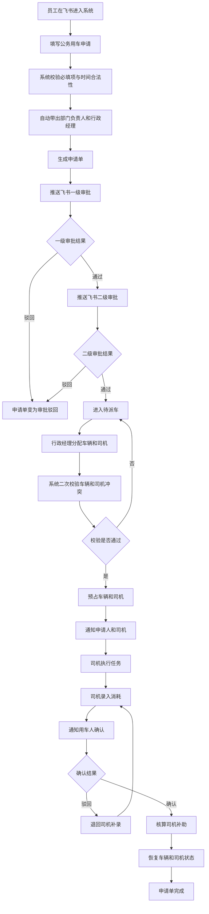
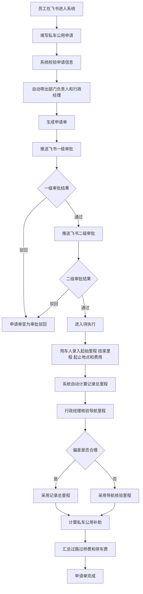
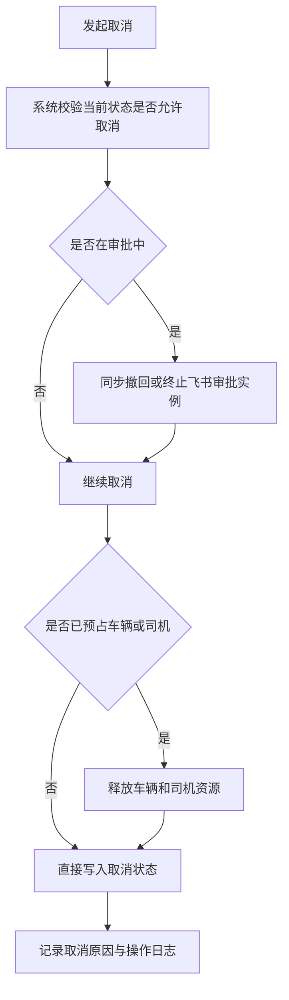
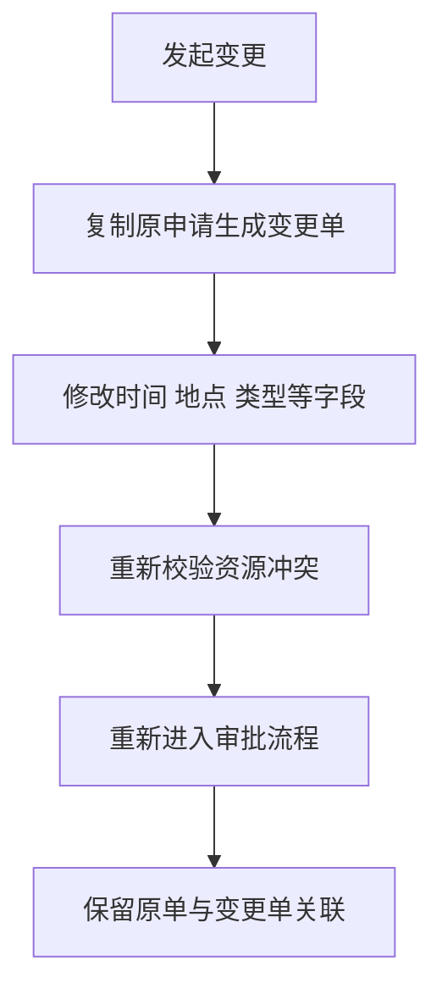
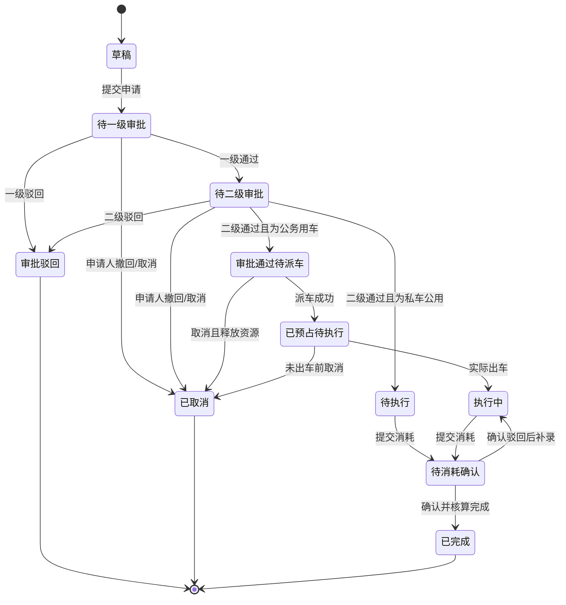
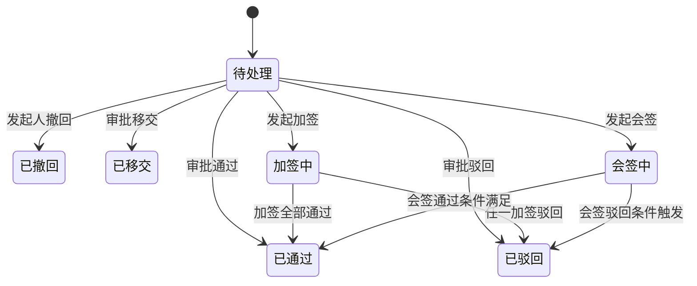
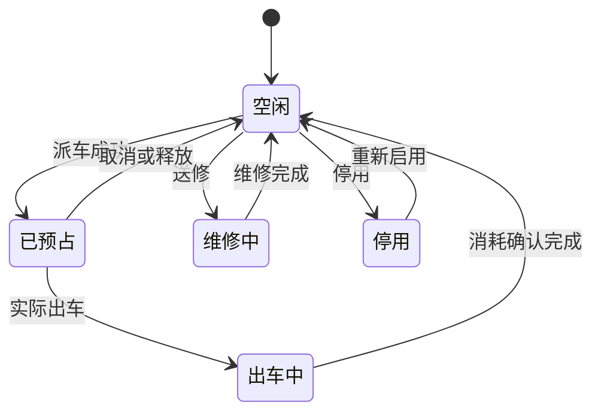
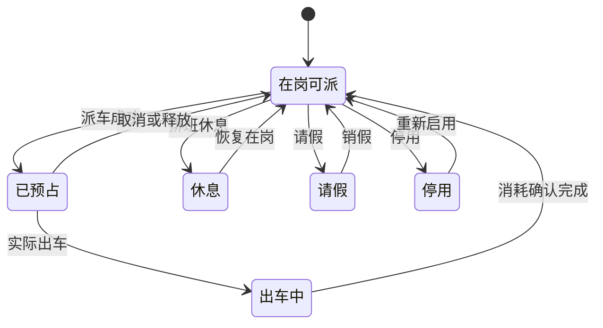
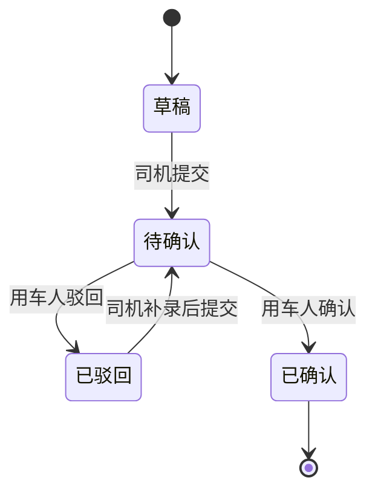

# 公务用车管理系统：核心流程图与状态机 V1

## 1. 文档说明

本文档用于明确公务用车管理系统的核心业务流程、状态流转与关键节点处理规则，作为后续原型设计、接口设计、数据库设计和开发实现的依据。

相关文档：

- [系统架构与流程边界V1.md](系统架构与流程边界V1.md>)
- [需求分析文档V1.md](需求分析文档V1.md>)

## 2. 流程设计原则

- 业务主状态统一由新系统维护
- 飞书承载审批动作，但不承载业务主状态
- 审批撤回、移交、加签、会签记录在审批记录中
- 派车前必须二次校验资源可用性
- 核算以“已确认消耗”为最终依据
- 历史状态不可覆盖，只能流转

## 3. 核心流程图

### 3.1 公务用车主流程

### 3.2 私车公用主流程

### 3.3 申请取消流程

### 3.4 申请变更流程

## 4. 关键状态机

### 4.1 申请单状态机

说明：

- 私车公用一般不进入“审批通过待派车”和“已预占待执行”两个状态
- 审批移交、加签、会签不改变申请单主状态，仅影响审批完成条件和审批记录

### 4.2 审批记录状态机

### 4.3 车辆状态机

### 4.4 司机状态机

### 4.5 消耗记录状态机

说明：

- 公务用车的消耗记录由司机提交、用车人确认
- 私车公用的里程与费用记录由用车人提交，行政经理核验确认

## 5. 关键节点说明

### 5.1 为什么需要“已预占”状态

审批通过与实际出车之间可能存在时间差。若审批通过后不立即锁定资源，后续申请可能重复占用同一车辆或司机，因此需要在派车后进入“已预占”状态。

### 5.2 为什么需要“审批记录状态”与“申请主状态”分离

审批存在移交、加签、会签和撤回等复杂动作。如果把这些动作直接映射到申请单主状态，会导致主状态复杂失控。更合理的方式是：

- 申请单维护业务主状态
- 审批记录维护审批过程状态

### 5.3 私车公用为什么改为“总里程 + 导航核验里程”

根据当前已确认业务规则，私车公用由用车人录入出车前里程和结束后里程，系统自动计算记录总里程，再由行政经理结合起止地点导航里程进行校核。

因此第一期更适合采用以下模型：

- 记录里程：结束后里程减去出车前里程
- 导航核验里程：根据起止地点校核得到
- 核算里程：最终用于补助计算的里程

若后续出现多段停靠、复杂路线或跨城中转场景，再扩展“行程段明细”会更合适。

## 6. 异常流程建议

### 6.1 审批同步异常

- 业务单已创建但飞书审批实例创建失败时，申请单进入“审批发起异常”
- 系统应支持重试或人工补发审批

### 6.2 派车时资源已被占用

- 重新提示冲突原因
- 保持“审批通过待派车”状态
- 支持重新分配车辆或司机

### 6.3 消耗确认长期未处理

- 系统定时发送飞书提醒
- 必要时通知行政经理介入

## 7. 下一步设计输入

基于本文档，下一步可继续展开：

1. 数据实体关系设计
2. 核心字段清单
3. 页面原型
4. 接口清单
